# SonarQube (SonarCloud) + Snyk + GitHub Actions Pipeline Setup Guide

This repo's pipeline ([.github/workflows/complete-workflow.yml](.github/workflows/complete-workflow.yml)) runs three jobs on every push:

1. **build** — Maven build + unit tests + SAST scan via **SonarCloud**
2. **security** — SCA (dependency vulnerability) scan via **Snyk**
3. **zap_scan** — DAST scan via **OWASP ZAP** (targets a public demo site, no setup needed)

You need accounts/tokens for SonarCloud and Snyk before the pipeline can run successfully. Steps below.

---

## Prerequisites: push this project to GitHub

This folder is not yet a git repository, and GitHub Actions only runs on GitHub. From the project root:

```bash
git init
git add .
git commit -m "Initial commit"
```

Create a new empty repo on GitHub (via the web UI), then:

```bash
git remote add origin https://github.com/<your-username>/<your-repo>.git
git branch -M main
git push -u origin main
```

> Note: the workflow's `security` and `zap_scan` jobs check out `master`/refs from `master` explicitly (`actions/checkout@master`, `ref: master`). If your default branch is `main`, either rename your branch to `master` or update the workflow (see [Common gotchas](#common-gotchas) below).

---

## 1. Set up SonarQube (SonarCloud)

The workflow uses **SonarCloud** (the SaaS version of SonarQube), not a self-hosted SonarQube server — you can see this from `-Dsonar.host.url=https://sonarcloud.io`.

1. Go to https://sonarcloud.io click on login and sign in with your account or create a new account.

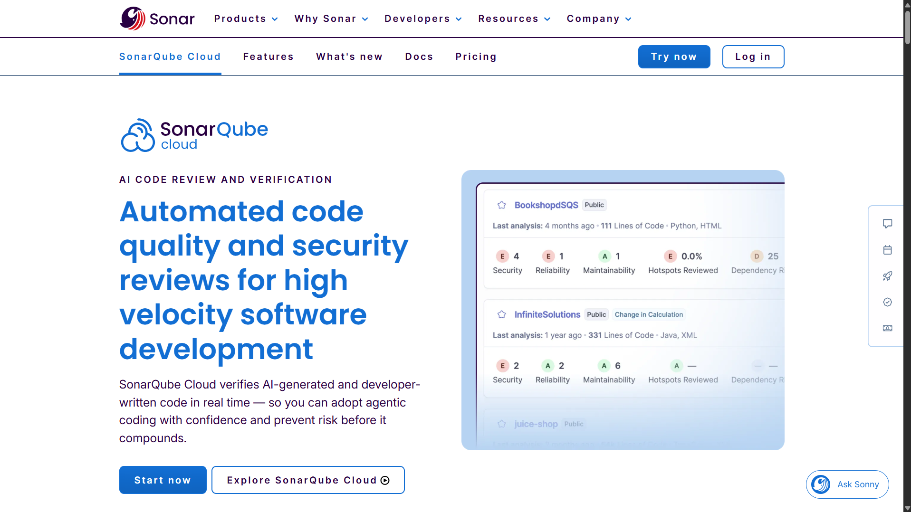

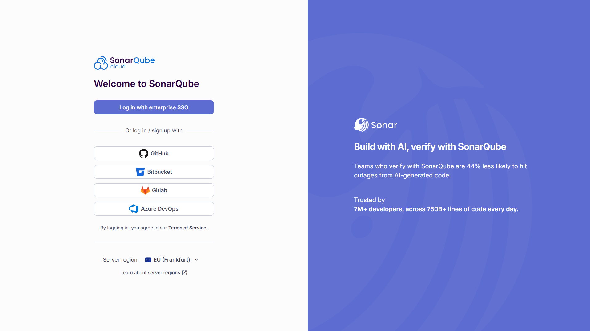

2. Click **+ (Add)** → **Analyze new project**, and import your GitHub repository.

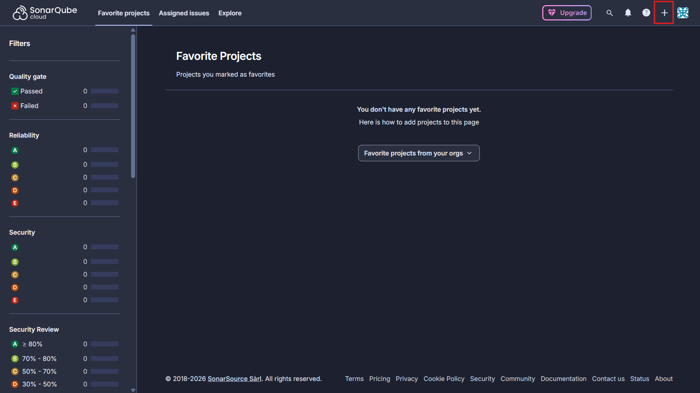

   - Choose the **Analayze New Project** option and select your GitHub repository and click on **Set Up**.

   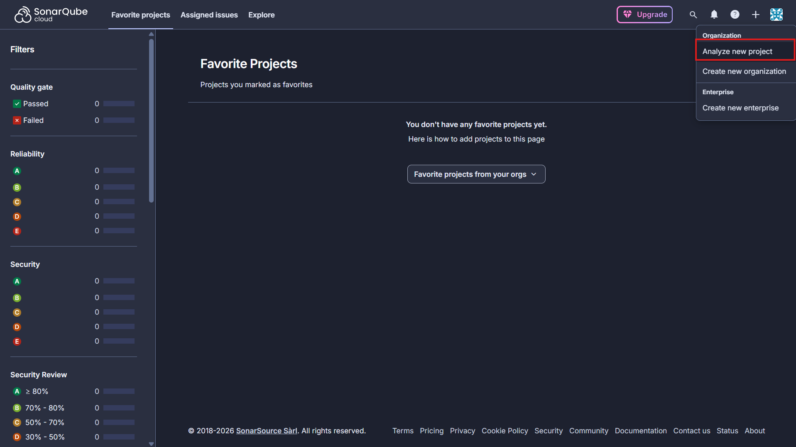

   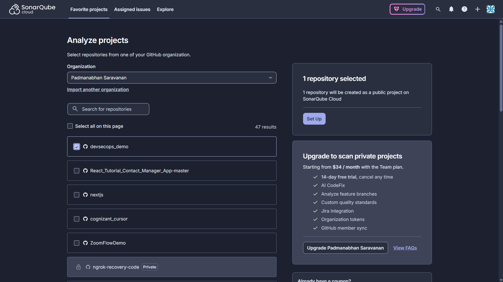

   - Select **Previous Version** and click on **Create Project**.

   

   - On left menu click on **Administration** -> **Analysis Method** and Disable the **Automatic Analysis** option for the project.

   

   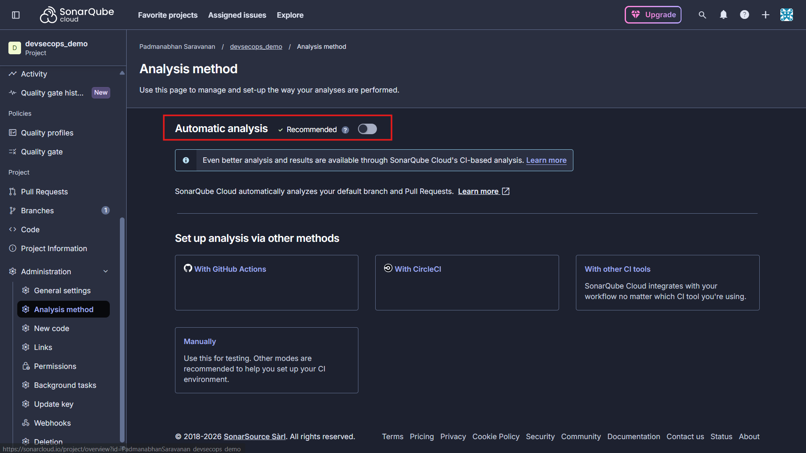

3. Note down / set these two values — they must match the workflow:

   - On left menu click on **Project Information** where you can find the **Project Key** and **Organization Key**. These values are used in the workflow as `sonar.projectKey` and `sonar.organization` respectively.

   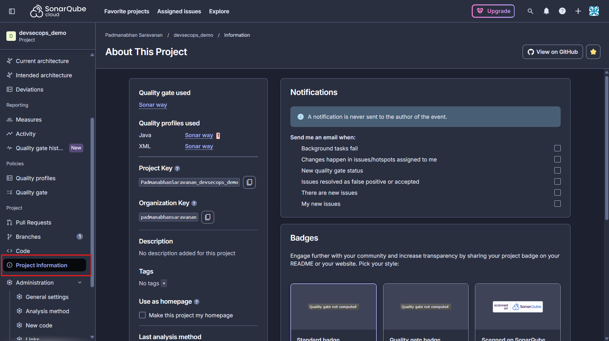

4. Generate a token

   - On Top right corner click on your profile and select **My Account** → **Access Tokens** → **Generate Tokens**. Give it a name and click on **Generate Token**. Copy the token (you won't be able to see it again).

   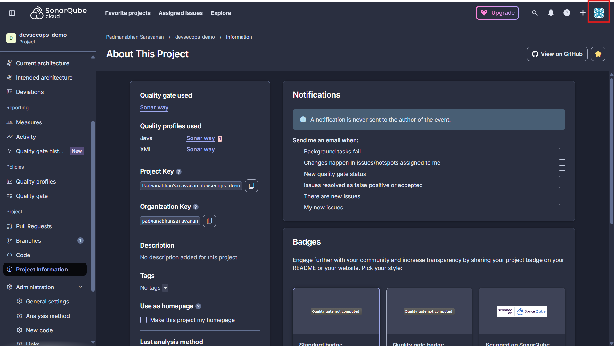

   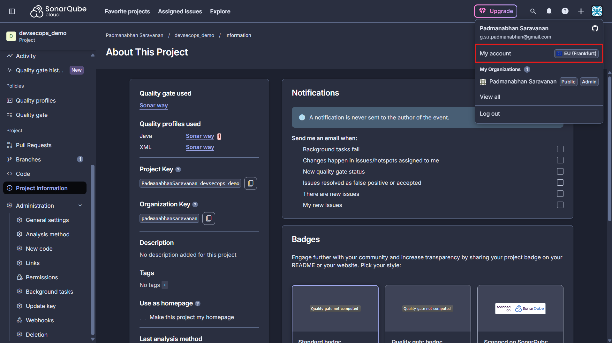

   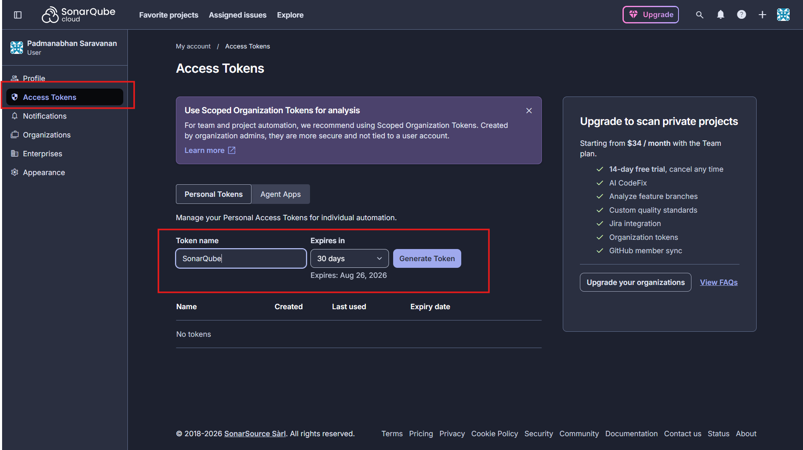


5. In your GitHub repo, go to **Settings → Secrets and variables → Actions → New repository secret**:

   - Name: `SONAR_TOKEN`
   - Value: the token you copied

   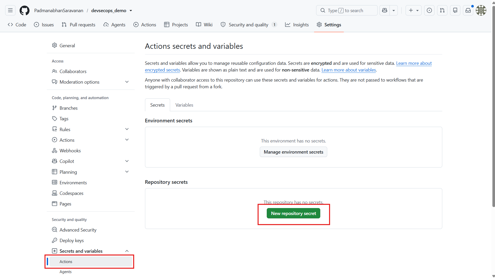

   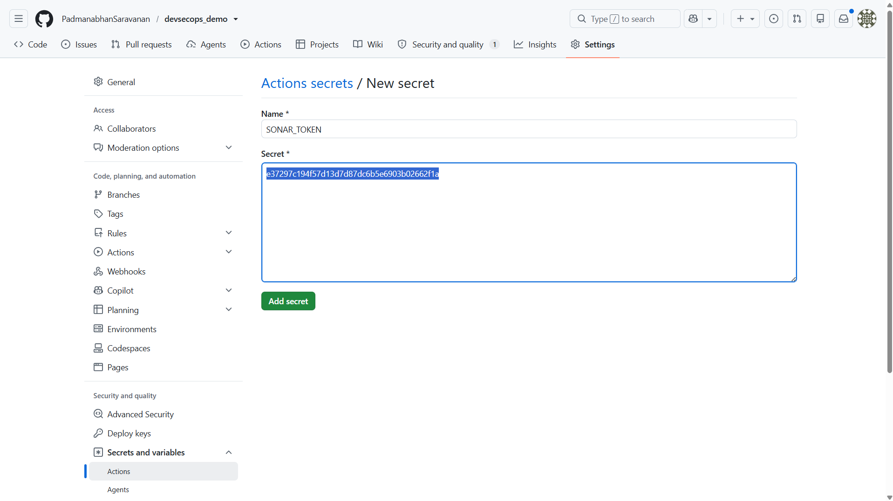

6. `GITHUB_TOKEN` is provided automatically by GitHub Actions — no setup needed.

---

## 2. Set up Snyk

1. Go to https://snyk.io and sign up, authenticating via GitHub is easiest.


2. Get your API token: click your avatar (bottom-left) → **Account Settings** → **Personal Access Tokens** -> provide name and expiry and select **Generate new token**.


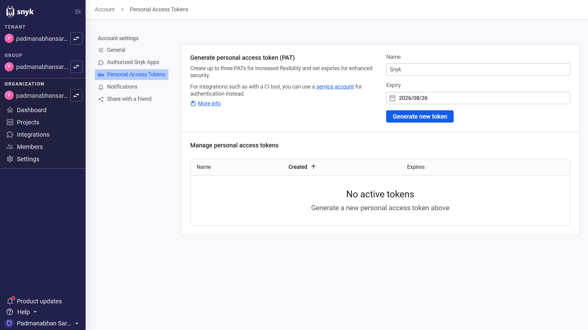

3. In your GitHub repo, add another secret:

   - Name: `SNYK_TOKEN`
   - Value: the token you copied


4. Nothing else is required — `snyk/actions/maven@master` auto-detects `pom.xml` and runs `snyk test` against it. The job has `continue-on-error: true`, so vulnerabilities found won't fail the pipeline.

---

## 3. ZAP (DAST) — no setup needed

The `zap_scan` job scans `http://example.com/` using `zaproxy/action-baseline`, so it works out of the box.

- `allow_issue_writing: false` is set because the default `GITHUB_TOKEN` doesn't have `issues: write` permission — without this flag, the action tries to auto-file a GitHub issue with the findings and fails with `403 Resource not accessible by integration`. Reports are still generated as job output/artifacts either way.

---

## 4. Run the pipeline

Once both secrets (`SONAR_TOKEN`, `SNYK_TOKEN`) are set and the branch naming matches:

```bash
git add .
git commit -m "Trigger pipeline"
git push
```

The workflow is set to `workflow_dispatch` (manual trigger only — it will not run automatically on push). To run it:

- **Via GitHub UI**: go to your repo's **Actions** tab → select "Build code, run unit test, run SAST, SCA, DAST security scans" in the left sidebar → click **Run workflow** → choose the branch → **Run workflow**.
- **Via GitHub CLI**: `gh workflow run complete-workflow.yml --ref master` (swap `master` for your branch name).

Then watch it run under your repo's **Actions** tab on GitHub.

---